# POWORK 🚀

## 🌟 Giới thiệu

POWORK là dự án công nghệ tham dự **VietFuture Awards 2026**, hạng mục *Các sản phẩm, ứng dụng công nghệ khác*. 

Dự án hướng tới việc giải quyết triệt để bài toán bất đối xứng thông tin trong tuyển dụng CNTT hiện nay. Bằng cách thay thế các bản CV tĩnh dễ dàng bị thổi phồng, POWORK buộc ứng viên phải chứng minh năng lực thông qua các bài toán nghiệp vụ thực tế, đồng thời bảo vệ họ khỏi mọi thiên kiến tuyển dụng.

<p align="center">
  
</p>
## 👥 Đội ngũ phát triển

Dự án được kiến trúc và phát triển bởi nhóm sinh viên đến từ ĐHQG-HCM:

| Họ và Tên | Vai trò | Đơn vị |
| :--- | :--- | :--- |
| **Đoàn Tấn Phong** | Techlead / QA | ĐH Khoa học Tự nhiên (HCMUS) |
| **Phan Lê Thành Nhân** | Frontend Lead | ĐH Khoa học Tự nhiên (HCMUS) |
| **Trương Minh Quang** | Backend Core | ĐH Khoa học Tự nhiên (HCMUS) |
| **Mai Đăng Khoa** | Frontend Developer | ĐH Khoa học Tự nhiên (HCMUS) |
| **Nguyễn Tấn Phúc Thịnh** | DevOps / Infrastructure | ĐH Công nghệ Thông tin (UIT) |

## 💡 Tính năng cốt lõi (Core Features)

- 🎯 **Thử thách thực chiến (Challenges):** Doanh nghiệp tự định nghĩa đề bài và bộ tiêu chí chấm điểm (Rubric) tùy biến theo văn hóa và đặc thù của dự án nội bộ.
- 🎭 **Chấm điểm mù (Blind Audition):** Cách ly hoàn toàn thông tin định danh (Tên, Trường học, Tuổi tác) khỏi luồng đánh giá. Mọi ID đều được mã hóa ẩn danh một chiều (SHA-256). Thông tin chỉ được "mở khóa" khi năng lực thực tế thuyết phục được nhà tuyển dụng.
- 📊 **Hồ sơ năng lực động (Dynamic Profile):** Những giải pháp xuất sắc nhất được lưu trữ bằng công nghệ Snapshot, tự động bồi đắp thành một hồ sơ năng lực bất biến theo thời gian.
- 🏢 **Talent Pool:** Không gian giúp doanh nghiệp lưu trữ, quản lý và theo dõi các nhân tài đã vượt qua vòng thử thách.



## 🏗️ Kiến trúc & Công nghệ (Tech Stack)

POWORK được thiết kế theo kiến trúc **Modular Monolith** kết hợp nguyên lý *Loosely Coupling*, tối ưu cho tốc độ phát triển nhưng vẫn sẵn sàng (Microservices-ready) cho các giai đoạn mở rộng.

### Frontend
- **Framework:** Next.js (App Router, Server-Side Rendering)
- **Styling:** TailwindCSS
- **State Management:** TanStack React Query
- **Testing/Mocking:** MSW (Mock Service Worker)

### Backend
- **Core:** Node.js & Express.js
- **Database:** PostgreSQL (Loại bỏ ràng buộc khóa ngoại cứng liên phân hệ để đảm bảo tính độc lập dữ liệu).
- **ORM:** Prisma (Type-safe query, Interactive Transactions chống Race Condition).

### Infrastructure & Security
- **Object Storage:** MinIO (Tải/Upload file dung lượng lớn trực tiếp qua Presigned URL, giải phóng băng thông cho server API).
- **Anti-Malware:** ClamAV (Quét mã độc luồng dữ liệu tự động).
- **Containerization:** Docker & Docker Compose.
- **CI/CD:** GitHub Actions (Tự động Linting, Build test và kiểm định cấu trúc Database).

## 🚀 Hướng dẫn khởi chạy (Getting Started)

Dự án đã được cấu hình sẵn các tệp lệnh để khởi động tự động thông qua Docker.

1. **Clone repository:**
   ```bash
   git clone <repository-url>
   cd "Project Github"
   ```

2. **Khởi động môi trường:**

   - **Dành cho Windows:**
     ```cmd
     .\start.bat
     ```

   - **Dành cho macOS / Linux:**
     ```bash
     docker compose up --build -d
     ```

3. **Truy cập:**
   - Giao diện người dùng (Frontend): `http://localhost:3000`
   - Máy chủ API (Backend): `http://localhost:3001`

---
*Sản phẩm trí tuệ thuộc về nhóm sinh viên dự án POWORK - Cuộc thi Sáng tạo Tương lai VietFuture Awards 2026.*
