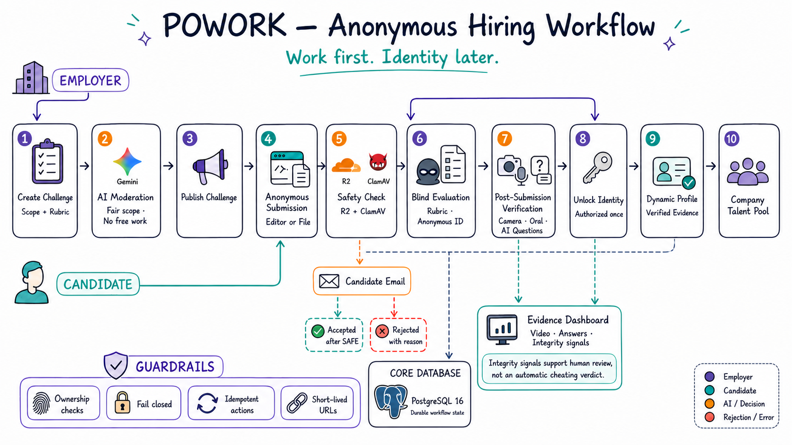

<p align="center">
  
</p>

<h1 align="center">POWORK</h1>

<p align="center">
  <strong>Đánh giá bài làm trước. Mở khóa danh tính sau.</strong>
</p>

<p align="center">
  Nền tảng phỏng vấn ẩn danh và đánh giá năng lực qua thử thách thực tế.
</p>

<p align="center">
  <a href="https://github.com/doantanphong-hcmus/C-reer_POWORK/actions/workflows/ci.yml"></a>
  
  
  
  <a href="./LICENSE"></a>
</p>

<p align="center">
  <sub>VietFuture Awards 2026 · Hạng mục Các sản phẩm, ứng dụng công nghệ khác</sub>
</p>

## Lời cảm ơn

Nhóm trân trọng cảm ơn **giảng viên hướng dẫn** đã đồng hành bằng những phản biện chuyên môn, giúp dự án nhìn rõ hơn các vấn đề về tính công bằng, khả năng xác minh và giá trị thực tế của quy trình tuyển dụng.

Nhóm cũng trân trọng môi trường học tập và tinh thần đổi mới sáng tạo từ **Trường Đại học Khoa học Tự nhiên, ĐHQG-HCM** và **Trường Đại học Công nghệ Thông tin, ĐHQG-HCM**; đồng thời cảm ơn **Ban Tổ chức VietFuture Awards 2026** đã tạo nên một sân chơi để sinh viên đưa ý tưởng ra khỏi phạm vi bài tập, đối diện với những câu hỏi thật về người dùng, công nghệ và khả năng phát triển sản phẩm.

<p align="center">
  <a href="https://hcmus.edu.vn/" title="Trường Đại học Khoa học Tự nhiên, ĐHQG-HCM">
    <picture>
      <source media="(prefers-color-scheme: dark)" srcset="./assets/acknowledgements/hcmus-white.png" />
      
    </picture>
  </a>
  &nbsp;&nbsp;&nbsp;&nbsp;&nbsp;&nbsp;
  <a href="https://www.uit.edu.vn/" title="Trường Đại học Công nghệ Thông tin, ĐHQG-HCM">
    <picture>
      <source media="(prefers-color-scheme: dark)" srcset="./assets/acknowledgements/uit-white.png" />
      
    </picture>
  </a>
  &nbsp;&nbsp;&nbsp;&nbsp;&nbsp;&nbsp;
  <a href="https://vietfuture.world/" title="VietFuture Awards 2026">
    <picture>
      <source media="(prefers-color-scheme: dark)" srcset="./assets/acknowledgements/vietfuture-2026-white.png" />
      
    </picture>
  </a>
</p>

<p align="center">
  <sub>Các biểu trưng ghi nhận môi trường đào tạo của thành viên và cuộc thi mà dự án tham gia.</sub>
</p>

---

Thông thường, nhà tuyển dụng nhìn thấy con người trước rồi mới quyết định có xem năng lực của họ hay không. POWORK đảo lại thứ tự đó.

```text
Tuyển dụng thông thường:  Danh tính → CV → Sàng lọc → Bài làm
POWORK:                 Challenge → Bài làm ẩn danh → Đánh giá → Danh tính
```

Đây không phải một giao diện che tên Candidate. Việc ẩn danh, chấm điểm, xác minh và mở khóa được thực thi bằng quyền truy cập, transaction và ràng buộc dữ liệu ở Backend. Thay ID trong URL, gửi lại request hoặc gọi API đồng thời không được phép làm thay đổi thứ tự này.

## POWORK giải quyết điều gì?

CV vẫn hữu ích, nhưng không phải lúc nào cũng phản ánh đúng năng lực thực hiện công việc. Đồng thời, một bài tuyển dụng thực tế thiếu giới hạn có thể biến thành yêu cầu lấy ý tưởng hoặc sản phẩm miễn phí từ Candidate.

POWORK xử lý hai phía của bài toán. Employer phải phát hành một Challenge có phạm vi hợp lý và Rubric rõ ràng. Candidate được đánh giá bằng bài làm dưới danh tính ẩn danh. Chỉ khi năng lực đã được xem xét và các điều kiện đánh giá đã hoàn tất, Employer mới có thể mở khóa danh tính.

Kết quả là một quy trình mà cả hai phía đều phải đưa ra bằng chứng: doanh nghiệp chứng minh Challenge là công bằng; ứng viên chứng minh năng lực bằng bài làm và phiên xác minh.

## Luồng hoạt động



<sub>Các nhãn hiệu Gemini, Cloudflare, ClamAV và PostgreSQL được sử dụng để nhận diện những công nghệ được tích hợp trong POWORK. Quyền đối với các nhãn hiệu thuộc về chủ sở hữu tương ứng; việc xuất hiện trong sơ đồ không hàm ý tài trợ, hợp tác hay chứng thực.</sub>

1. Employer tạo Challenge và thiết lập Rubric chấm điểm.
2. AI kiểm tra phạm vi Challenge trước khi cho phép phát hành.
3. Candidate lựa chọn Challenge và nộp bài bằng trình soạn thảo hoặc tệp đính kèm.
4. Tệp được quét an toàn trước khi xuất hiện trong quy trình đánh giá.
5. Employer chấm bài dưới danh tính ẩn danh theo Rubric đã công bố.
6. Candidate hoàn thành phiên xác minh sau nộp bài bằng camera, phần trình bày và câu hỏi tự luận do AI tạo.
7. Employer chỉ xem bằng chứng xác minh và mở khóa danh tính khi đáp ứng đúng điều kiện phân quyền.
8. Kết quả đã được xác nhận tiếp tục bồi đắp Dynamic Profile và Talent Pool của doanh nghiệp.

## Chức năng chính

### Challenge và kiểm duyệt nội dung bằng AI

Employer có thể tạo Challenge, thời hạn và bộ tiêu chí chấm điểm phù hợp với nhu cầu tuyển dụng. Trước khi Challenge được phát hành, Gemini phân tích nội dung theo một contract cố định. Hệ thống chặn theo hướng an toàn khi nội dung yêu cầu dữ liệu thật, có phạm vi quá lớn, giải quyết trực tiếp vấn đề nội bộ hoặc yêu cầu Candidate tạo ra sản phẩm hoàn chỉnh.

### Nộp bài linh hoạt và an toàn

Candidate có thể viết bài trực tiếp bằng trình soạn thảo Rich Text hoặc Markdown, hoặc tải lên tệp bài làm. Tệp được lưu bằng object key ẩn danh trên Cloudflare R2 và được ClamAV kiểm tra trước khi Employer có thể truy cập. Trạng thái chờ upload, chờ quét, an toàn, bị từ chối và lỗi quét được phân biệt rõ; lỗi dịch vụ quét không bao giờ được xem là kết quả an toàn.

### Phỏng vấn ẩn danh theo Rubric

Trong giai đoạn đánh giá, Employer nhìn thấy bài làm và mã ẩn danh ổn định của Candidate trong từng Challenge, không nhìn thấy tên, email hoặc thông tin cá nhân. Điểm số phải tuân theo Rubric của đúng Challenge, nằm trong giới hạn cho phép và được bảo vệ khỏi việc ghi trùng hoặc thay đổi snapshot đã xác nhận.

### Xác minh sau khi nộp bài

Candidate thực hiện một phiên xác minh có camera và microphone, lựa chọn thời lượng trình bày 15, 30, 60 hoặc 120 giây, sau đó trả lời từ một đến ba câu tự luận do Gemini tạo riêng từ nội dung Challenge và Rubric. Bộ câu hỏi được kiểm tra cấu trúc và giữ nguyên trong suốt phiên.

Giao diện ghi nhận các tín hiệu như gián đoạn camera, mất tập trung hoặc thao tác dán bị chặn. Đây là dữ liệu hỗ trợ Employer xem xét trong ngữ cảnh, không phải kết luận tự động về gian lận. Video xác minh cũng được quét an toàn trước khi chuyển sang trạng thái sẵn sàng.

### Dashboard bằng chứng dành cho Employer

Trước khi mở khóa, Employer chỉ nhận được thông tin tóm tắt không chứa câu trả lời, video hoặc danh tính Candidate. Sau khi đáp ứng điều kiện mở khóa và vượt qua kiểm tra quyền sở hữu Challenge, Employer có thể xem timeline, thời lượng, câu hỏi, câu trả lời, các tín hiệu phiên và video thông qua presigned URL ngắn hạn.

### Dynamic Profile và Talent Pool

Các kết quả đã được đánh giá trở thành bằng chứng năng lực trong Dynamic Profile của Candidate. Doanh nghiệp chỉ có thể đưa vào Talent Pool những Candidate thuộc đúng phạm vi mà doanh nghiệp đã mở khóa, giúp hình thành nguồn ứng viên dựa trên năng lực đã được chứng minh thay vì dữ liệu hồ sơ tự khai.

### Thông báo kết quả nộp bài

Candidate nhận email xác nhận khi bài nộp văn bản được tiếp nhận hoặc khi tệp đã vượt qua bước quét an toàn. Nếu tệp bị từ chối, email nêu rõ nguyên nhân và hướng dẫn gửi lại. Sự cố gửi email không làm sai lệch trạng thái an toàn của bài nộp.

## Nguyên tắc bảo vệ hệ thống

| Nguyên tắc                    | Cách POWORK áp dụng                                                                                |
| ----------------------------- | -------------------------------------------------------------------------------------------------- |
| Đánh giá trước, định danh sau | Identity của Candidate được tách khỏi dữ liệu đánh giá và chỉ mở khóa có kiểm soát.                |
| Phân quyền theo quyền sở hữu  | Employer chỉ truy cập Submission thuộc Challenge của chính công ty mình.                           |
| Fail closed                   | Lỗi AI, lỗi scan hoặc response không đúng contract không được xem là thành công.                   |
| Chống thao tác lặp            | Các luồng tạo phiên, sinh câu hỏi, hoàn tất xác minh và unlock được thiết kế idempotent.           |
| Không lộ danh tính qua tệp    | Object key không chứa user ID, email, họ tên hoặc tên tệp gốc.                                     |
| Dữ liệu nhất quán             | Transaction và ràng buộc database ngăn trạng thái hoàn thành một phần hoặc bản ghi hiệu lực trùng. |

## Những điều repository này chứng minh được

Các tuyên bố quan trọng của POWORK không chỉ tồn tại trong tài liệu. Chúng được khóa lại bằng test tại đúng ranh giới có rủi ro.

| Contract cần giữ                                                       | Bằng chứng trong mã nguồn                                                                                                                                      |
| ---------------------------------------------------------------------- | -------------------------------------------------------------------------------------------------------------------------------------------------------------- |
| Employer không thể đổi Submission ID để xem dữ liệu công ty khác       | [`assessment-ownership.test.js`](./Backend/test/assessment-ownership.test.js)                                                                                  |
| Danh tính không xuất hiện trong luồng blind audition                   | [`blind-audition.test.js`](./Backend/test/blind-audition.test.js)                                                                                              |
| Criterion, score và evaluation tuân thủ đúng Challenge                 | [`evaluation-integrity.test.js`](./Backend/test/evaluation-integrity.test.js)                                                                                  |
| Unlock lặp hoặc đồng thời không tạo Evidence trùng                     | [`unlock-and-evidence.test.js`](./Backend/test/unlock-and-evidence.test.js)                                                                                    |
| Tệp chưa an toàn và lỗi ClamAV không được xem là hợp lệ                | [`file-safety.test.js`](./Backend/test/file-safety.test.js)                                                                                                    |
| Gemini lỗi hoặc trả sai schema không tạo dữ liệu hoàn thành một phần   | [`challenge-moderation.test.js`](./Backend/test/challenge-moderation.test.js), [`verification-question.test.js`](./Backend/test/verification-question.test.js) |
| Video, câu trả lời và evidence chỉ xuất hiện sau đúng điều kiện unlock | [`verification-evidence.test.js`](./Backend/test/verification-evidence.test.js)                                                                                |
| Frontend gọi verification qua một API contract thống nhất              | [`verification-api-contract.test.mjs`](./Frontend/test/verification-api-contract.test.mjs)                                                                     |

Chạy toàn bộ các kiểm tra này bằng các lệnh trong phần [Kiểm tra chất lượng mã nguồn](#kiểm-tra-chất-lượng-mã-nguồn).

## Kiến trúc hệ thống

POWORK sử dụng kiến trúc modular monolith để giữ tốc độ phát triển phù hợp với quy mô hiện tại, đồng thời phân tách rõ các miền nghiệp vụ IAM, Challenge, Assessment, Profile và Talent Pool.

```text
Browser
   │
   ▼
Next.js Frontend / BFF
   │
   ▼
Express Backend API
   ├── PostgreSQL + Prisma
   ├── Cloudflare R2
   ├── ClamAV
   ├── Gemini API
   └── SMTP
```

Frontend ánh xạ dữ liệu `snake_case` và `camelCase` tại ranh giới API. Backend tổ chức theo controller, service và repository; các quyết định phân quyền và toàn vẹn dữ liệu được thực thi ở phía máy chủ thay vì dựa vào giao diện.

### Vì sao kiến trúc được chọn như vậy?

| Quyết định                           | Lý do                                                                                                                        |
| ------------------------------------ | ---------------------------------------------------------------------------------------------------------------------------- |
| Modular monolith                     | Một deployment unit phù hợp với quy mô nhóm, nhưng ranh giới nghiệp vụ vẫn rõ để tránh một khối mã nguồn phụ thuộc lẫn nhau. |
| Backend là authority                 | Role, ownership, trạng thái và quyền unlock không thể bị bỏ qua bằng cách gọi API trực tiếp.                                 |
| Mapping tại API boundary             | Service chỉ nhận một dạng dữ liệu nội bộ; không đoán cả `snake_case` lẫn `camelCase`.                                        |
| PostgreSQL constraints + transaction | Những invariant quan trọng vẫn đúng khi request lặp, chạy đồng thời hoặc thất bại giữa chừng.                                |
| Presigned URL                        | Tệp đi trực tiếp giữa trình duyệt và R2; Backend chỉ cấp quyền ngắn hạn và giữ quyền quyết định object key.                  |
| Fail closed                          | AI hoặc antivirus không đưa ra kết quả xác định thì quy trình dừng ở trạng thái lỗi thay vì giả định an toàn.                |

## Công nghệ sử dụng

| Khu vực             | Công nghệ                                                                                           |
| ------------------- | --------------------------------------------------------------------------------------------------- |
| Frontend            | Next.js 16, React 19, TypeScript, Tailwind CSS, TanStack React Query, Zustand, React Hook Form, Zod |
| Backend             | Node.js 20, Express, Prisma, Zod, JWT, Passport, Nodemailer                                         |
| Database            | PostgreSQL 16                                                                                       |
| AI                  | Gemini API qua native `fetch`, schema validation và timeout fail closed                             |
| Object storage      | Cloudflare R2 qua giao thức S3-compatible và presigned URL                                          |
| File safety         | ClamAV stream scanning                                                                              |
| Hạ tầng             | Docker, Docker Compose, GitHub Actions                                                              |
| Chất lượng mã nguồn | Node.js Test Runner, ESLint, Prettier, Husky                                                        |

## Cấu trúc repository

```text
.
├── Backend/             # Express API, Prisma schema, migrations và tests
├── Frontend/            # Next.js application và frontend tests
├── assets/              # Hình ảnh và sơ đồ sử dụng trong tài liệu
├── docker-compose.yml   # Môi trường chạy tích hợp
├── .env.example         # Mẫu cấu hình toàn hệ thống
├── po_workflow.svg      # Sơ đồ luồng phiên bản trước
└── start.bat            # Lệnh khởi động nhanh trên Windows
```

## Khởi chạy bằng Docker

### Yêu cầu

- Docker Engine và Docker Compose
- Một Cloudflare R2 private bucket cùng API token có quyền Object Read & Write
- Gemini API key cho kiểm duyệt Challenge và tạo câu hỏi xác minh
- Tài khoản SMTP nếu muốn kiểm thử email

### 1. Clone repository

```bash
git clone <repository-url>
cd "Project Github"
```

### 2. Tạo file cấu hình

Trên macOS hoặc Linux:

```bash
cp .env.example .env
```

Trên PowerShell:

```powershell
Copy-Item .env.example .env
```

Điền tối thiểu các biến sau trong `.env`:

```dotenv
GEMINI_API_KEY=
R2_ENDPOINT=
R2_ACCESS_KEY_ID=
R2_SECRET_ACCESS_KEY=
R2_BUCKET=
```

Để gửi email, cấu hình thêm:

```dotenv
SMTP_HOST=smtp.gmail.com
SMTP_PORT=587
SMTP_USER=
SMTP_PASS=
MAIL_FROM="POWORK <no-reply@powork.vn>"
```

Không commit file `.env` hoặc bất kỳ secret nào vào Git.

### 3. Cấu hình CORS cho R2

Bucket phải cho phép đúng origin của Frontend. Ví dụ khi chạy local:

```json
[
  {
    "AllowedOrigins": ["http://localhost:3000"],
    "AllowedMethods": ["GET", "PUT", "HEAD"],
    "AllowedHeaders": ["Content-Type"],
    "ExposeHeaders": ["ETag"],
    "MaxAgeSeconds": 3600
  }
]
```

Khi chạy trên GitHub Codespaces, thay origin bằng URL forwarded port 3000 của Codespace.

### 4. Khởi động hệ thống

Trên Windows:

```powershell
.\start.bat
```

Trên macOS, Linux hoặc GitHub Codespaces:

```bash
docker compose up --build -d --wait
```

### 5. Kiểm tra trạng thái

```bash
docker compose ps
curl http://localhost:3001/health
```

Các địa chỉ mặc định:

| Dịch vụ              | Địa chỉ                        |
| -------------------- | ------------------------------ |
| Frontend             | `http://localhost:3000`        |
| Backend API          | `http://localhost:3001`        |
| Backend health check | `http://localhost:3001/health` |
| PostgreSQL           | `localhost:5432`               |
| ClamAV               | `localhost:3310`               |

Xem log khi cần chẩn đoán:

```bash
docker compose logs --no-color --tail=200 backend frontend postgres clamav
```

Dừng hệ thống mà không xóa dữ liệu:

```bash
docker compose down
```

## Kiểm tra chất lượng mã nguồn

GitHub Actions hiện kiểm tra cài đặt dependency, format, lint, Prisma Client generation và Frontend build trên các pull request vào `develop` hoặc `main`. Các test nghiệp vụ bên dưới được chạy trực tiếp bằng Node.js Test Runner.

### Backend

```bash
cd Backend
npm ci
node --test
npm run lint
npx prettier --check "**/*.{js,json,md}"
```

### Frontend

```bash
cd Frontend
npm ci
npm test
npm run lint
npm run build
npx prettier --check "**/*.{js,jsx,ts,tsx,json,md,css}"
```

## Đội ngũ phát triển

| Thành viên            | Vai trò                 | Đơn vị                                       |
| --------------------- | ----------------------- | -------------------------------------------- |
| Đoàn Tấn Phong        | Tech Lead / QA          | Trường Đại học Khoa học Tự nhiên, ĐHQG-HCM   |
| Phan Lê Thành Nhân    | Frontend Lead           | Trường Đại học Khoa học Tự nhiên, ĐHQG-HCM   |
| Trương Minh Quang     | Backend Core            | Trường Đại học Khoa học Tự nhiên, ĐHQG-HCM   |
| Mai Đăng Khoa         | Frontend Developer      | Trường Đại học Khoa học Tự nhiên, ĐHQG-HCM   |
| Nguyễn Tấn Phúc Thịnh | DevOps / Infrastructure | Trường Đại học Công nghệ Thông tin, ĐHQG-HCM |

## Trạng thái dự án

POWORK hiện là MVP có thể chạy end-to-end, được phát triển cho VietFuture Awards 2026. Trọng tâm của repository là chứng minh luồng tuyển dụng ẩn danh, authorization, tính toàn vẹn khi xử lý đồng thời và khả năng tích hợp AI, object storage, antivirus và email trong một hệ thống triển khai được.

### Phạm vi chưa tuyên bố

README không coi tín hiệu từ trình duyệt là bằng chứng tuyệt đối về gian lận, không tuyên bố AI thay thế quyết định của con người và không mô tả MVP hiện tại như một dịch vụ production đã hoàn thiện. Các nhu cầu vận hành dài hạn như observability tập trung, backup/restore đã diễn tập, quản lý secret theo hạ tầng và kiểm thử tải cần được hoàn thiện trước khi triển khai thương mại ở quy mô lớn.

Sự minh bạch này là một phần của thiết kế: POWORK hỗ trợ quyết định tuyển dụng có căn cứ, không tự động đưa ra kết luận thay Employer.

## License

Dự án được phát hành theo [MIT License](./LICENSE).

---

<p align="center">
  Sản phẩm được phát triển bởi nhóm POWORK cho VietFuture Awards 2026.
</p>
